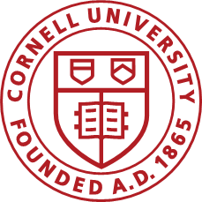
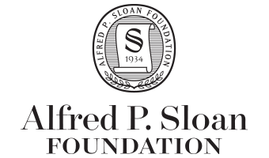

# Proceedings from SynLBD International Seminar

On May 9, 2017, we hosted a seminar to discuss the conditions necessary to implement the SynLBD approach with interested parties, with the goal of providing a straightforward toolkit to implement the same procedure on other data. 
The proceedings summarize the discussions during the workshop.

## Publication
The proceedings were published at https://hdl.handle.net/1813/52472 .

## Overleaf
https://www.overleaf.com/project/5c092a5ad8b3040e8d16e533

## Funding
Funding for the workshop was provided by the [National Science Foundation](https://www.nsf.gov) 
(Grants [1012593](https://www.nsf.gov/awardsearch/showAward?AWD_ID=1012593); 
[1131848](http://www.nsf.gov/awardsearch/showAward.do?AwardNumber=1131848) and 
the Alfred P. Sloan Foundation ([G-2015-13903](https://www.ilr.cornell.edu/labor-dynamics-institute/research/project-19)). 
Organizational support was provided by the [Labor Dynamics Institute](http://www.ilr.cornell.edu/ldi/) at [Cornell University](https://www.cornell.edu).

  

## License

